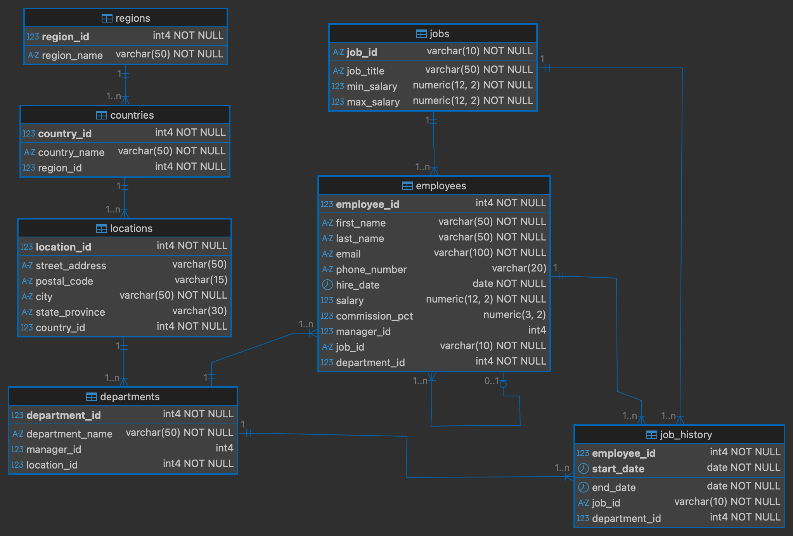

# HR-DB: Oracle Human Resources Schema for PostgreSQL 16.1

### Ported & Enhanced by [PaKo Araya](https://www.linkedin.com/in/franarayah/)

on [ **GitHub**](https://github.com/PakoAraya/PostgreSQL-HR) and [ **GitLab**](https://gitlab.com/PaKoAraya/postgresql-hr)

## Database Schema Preview

## General Information

This project is a modern and optimized recreation of the classic **Human Resources (HR)** Schema from Oracle Database. It is initially adapted for **PostgreSQL 16.1**, with a few minor changes to support the latest version currently in development.